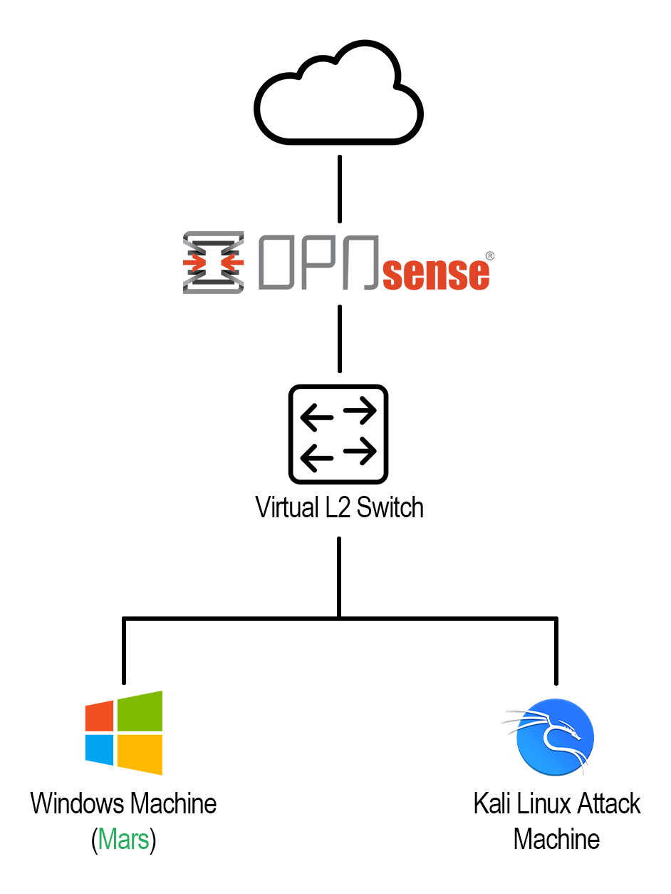
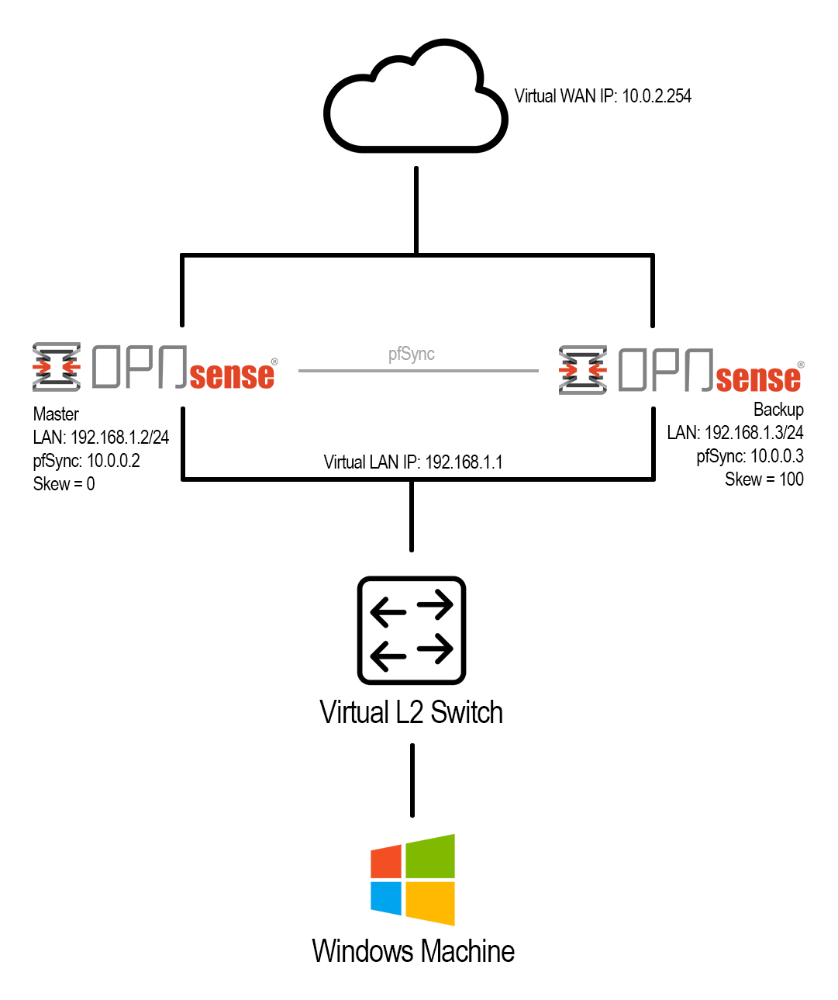

## Lab Journal

### 2025-11-01
- Installed **OPNsense**, **Kali Linux** on **VMware**
- Configured network adapters to make all Kali traffic go through OPNsense firewall
  - Issue: Kali could ping OPNsense but neither could ping the internet
  - Fix: Manually changed VMnet1 Host-only network to use same subnet addr as OPNsense
- Installed **Suricata** IDS/IPS
- Added rule to OPNsense to alert when the network is scanned with nmap:
```text
alert tcp $HOME_NET any -> 192.168.1.1/24 any (msg:"POSSIBLE NMAP SYNSTEALTH SCAN DETECTED"; flow:stateless; flags:S; priority:5; threshold:type threshold, track by_src, count 50, seconds 1; classtype:attempted-recon; sid:1234;)
```
- Tested out this rule by calling nmap `192.168.1.1` in terminal, successfully alerted

### 2025-11-04
**Scenario Introduction**

<span style="color:#27ae60;">Mars</span>, the visionary feline CEO of **Mars Industries**, is a leading innovator in his field:


He recently hired his first IT specialist, <span style="color:#2980b9;">Musya</span>, who is eager to contribute to the project, though still getting up to speed with corporate policies:


- Added a Windows machine with user "<span style="color:#27ae60;">Mars</span>"
- **Incident:** <span style="color:#2980b9;">Musya</span> was caught watching TikTok on her first day on the job, so <span style="color:#27ae60;">Mars</span> needs to implement content-filtering rules on the network
  - Enabled Unbound DNS
  - Set default DNS Server to `192.168.1.1` (OPNsense), turned off "Allow DNS server list ot be overridden by DHCP/PPP on WAN"
  - Added [this](https://cdn.jsdelivr.net/gh/hagezi/dns-blocklists@latest/wildcard/social.txt) list of blocklists (by GitHub user [hagezi](https://github.com/hagezi))
  - Resolved! <span style="color:#2980b9;">Musya</span> can no longer waste precious company time on social media.

As of now, this is how the Topology looks:



### 2025-11-07
- Issue: Noticed that on OPNsense startup, LAN devices could ping OPNsense without issue, and OPNsense could ping any address on the web, but LAN devices could not.
- Fix: Unbound DNS was simply not automatically starting on boot, meaning LAN devices could not resolve hostnames, so <span style="color:#27ae60;">Mars</span> turned it on.
- Issue: Windows machines could sometimes bypass using Unbound DNS by just going straight to `1.1.1.1` automatically
- Fix: Block other potential DNS server connections
  - Added an alias for DoH Server IPs using [this list](https://raw.githubusercontent.com/oneoffdallas/dohservers/master/iplist.txt)
  - Added a firewall rule to block any IP under that alias
  - Will need to add DoT server IPs in the future

### 2025-11-10
- <span style="color:#27ae60;">Mars</span> realized that if the firewall goes down, Mars Industries will go down, and the company will be in shambles. To make the network more resilient, he decided to deploy a high-availability setup using pfSense configured with CARP (Common Address Redundancy Protocol)
- Cloned the first firewall, assigned it the next available IP (`192.168.1.2`)
- Gave both firewalls a new interface to communicate, "SYNC"
- Changed firewall IPs to `192.168.1.2` and `192.168.1.3` so that they could cleanly share the virtual IP `192.168.1.1`
- Gave firewall WAN IPs `10.0.0.2` and `10.0.0.3`, and a shared virtual WAN IP `10.0.2.254`
- Configured High Availability settings
- Test: Ping `192.168.1.1` (LAN VIP), `192.168.1.2` (master firewall), `192.168.1.3` (backup firewall) before and after unplugging master
  - Before: All pings reply as expected
  - After: `192.168.1.2` fails, other two work as expected

Success! Below is a diagram of the HA setup topology:



### 2025-11-11
- <span style="color:#27ae60;">Mars</span> decided it was about time to upgrade the firewall with next-gen firewall capabilities to be prepared to deal with modern threats, so he decided to install **Zenarmor**.
  - Issue: Plugins list was empty, OPNsense couldn't be updated
  - Fix: It was DNS.
- Got an overview of all of the Zenarmor features, such as being able to see all of the currently open sessions and being able to block them, easier app/web controls (allowing/blocking them), and getting detailed breakdowns of network activity

### 2025-11-14
- After upgrading the network with high-availability and next-gen features, <span style="color:#27ae60;">Mars</span> realized that there was no centralized way to monitor security events across all systems, and alerts were all over the place (Suricata detected scans, Zenarmor blocked application, and OPNsense logged firewall events). So, he decided he needed a SIEM.
- Deployed **Wazuh Manager OVA**
- Assigned static IP `192.168.1.10` to the Wazuh WM on LAN segment 1 (connecting it to OPNsense)
- Installed a Wazuh Agent on <span style="color:#27ae60;">Mars</span>'s Windows VM
