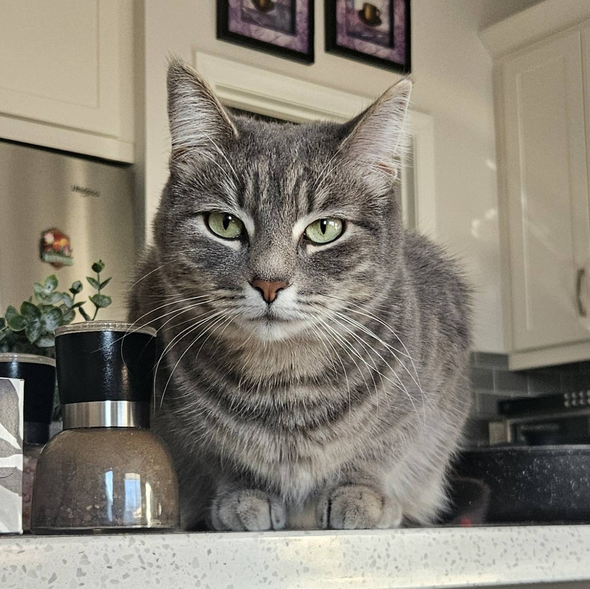

## Lab Journal

### 2025-11-01
- Installed OPNsense, Kali Linux on VMware
- Configured network adapters to make all Kali traffic go through OPNsense firewall
  - Issue: Kali could ping OPNsense but neither could ping the internet
  - Fix: Manually changed VMnet1 Host-only network to use same subnet addr as OPNsense
- Installed Suricata IDS/IPS
- Added rule to OPNsense to alert when the network is scanned with nmap:
```text
alert tcp $HOME_NET any -> 192.168.1.1/24 any (msg:"POSSIBLE NMAP SYNSTEALTH SCAN DETECTED"; flow:stateless; flags:S; priority:5; threshold:type threshold, track by_src, count 50, seconds 1; classtype:attempted-recon; sid:1234;)
```
- Tested out this rule by calling nmap 192.168.1.1 in terminal, successfully alerted

### 2025-11-04
**Scenario Introduction**

Mars, the visionary feline CEO of **Mars Industries**, is a leading innovator in his field:


He recently hired his first IT specialist, Musya, who is eager to contribute to the project, though still getting up to speed with corporate policies:



- Added a Windows machine with user "Mars"
- **Incident:** Musya was caught watching TikTok on her first day on the job, so Mars needs to implement content-filtering rules on the network
  - Enabled Unbound DNS
  - Set default DNS Server to 192.168.1.1 (OPNsense), turned off "Allow DNS server list ot be overridden by DHCP/PPP on WAN"
  - Added [this](https://cdn.jsdelivr.net/gh/hagezi/dns-blocklists@latest/wildcard/social.txt) list of blocklists (by GitHub user [hagezi](https://github.com/hagezi))
  - Resolved! Musya can no longer waste precious company time on social media.